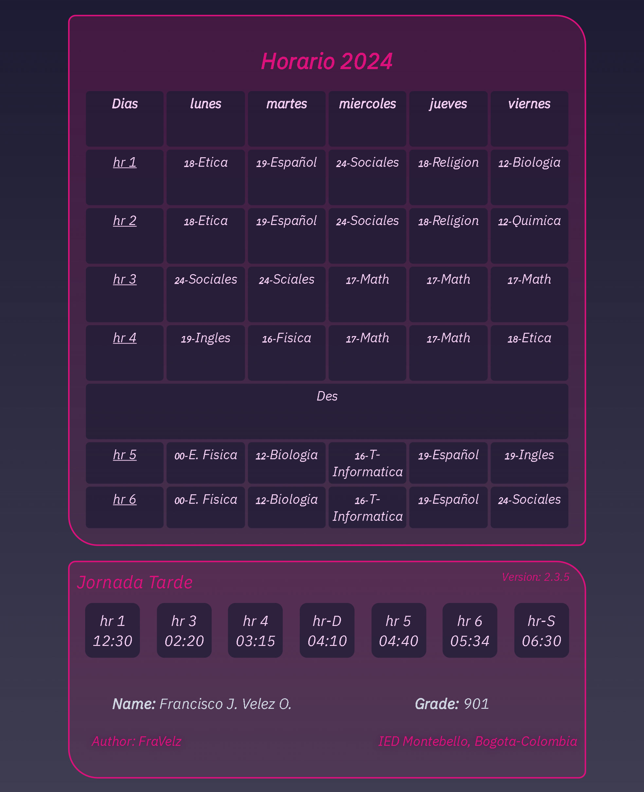
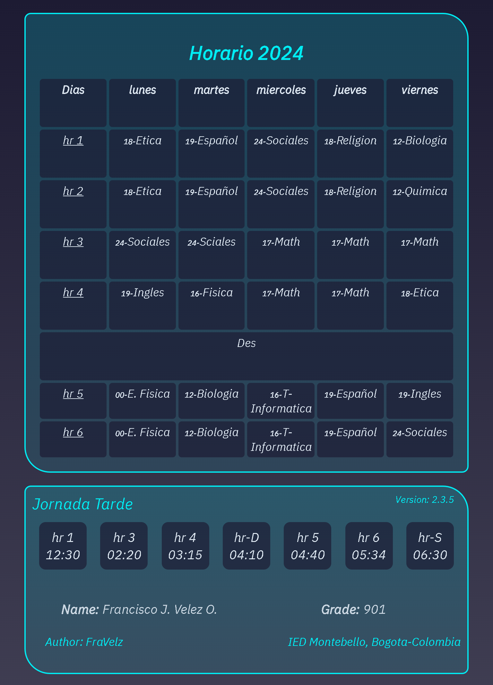
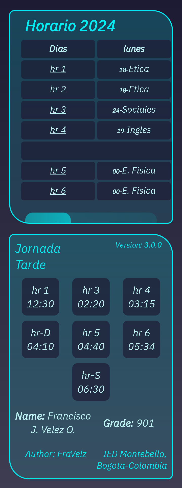
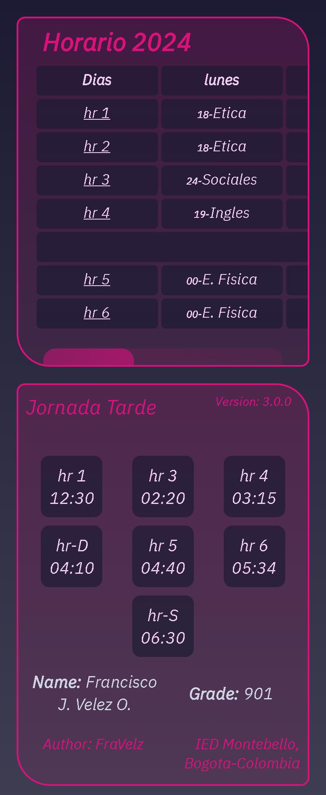
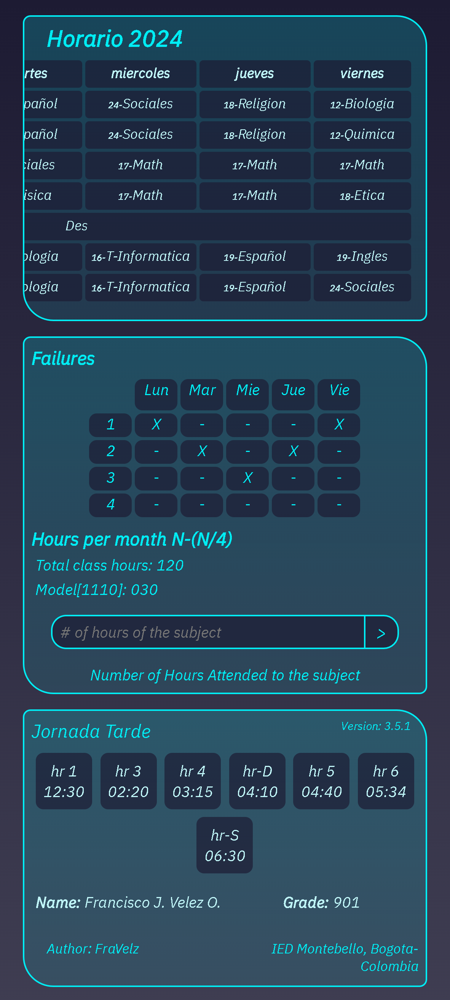

# HorarioDelColegio
* Horario => Color Rosa

* Horario V1.0.0 => Color Cyan

* Horario V2.0.0 => Color Cyan Moderno

* Horario V3.0.0 => Adaptable a Movil \

* Horario V3.1.0 => Adaptable a Movil Color Rosa

* Horario V3.5.1 => Nueva Funcion JS y 3 containers

> Author: FraVelz

Best regard :)
